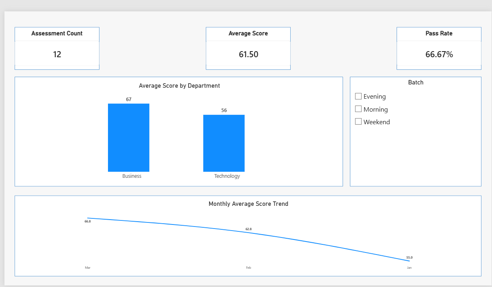

📊 Student Assessment Data Analysis

A complete data analysis project combining Python, SQL, Excel, and Power BI to transform student assessment data into meaningful insights.

  

  <b>Power BI Dashboard Preview</b> 
  Interactive dashboard built from the cleaned and analyzed assessment data.

🧭 Project Overview

This project analyzes student assessment performance across different courses, departments, batches, months, scores, and attendance levels.

The workflow follows a practical end-to-end data analytics process:

Raw Data → Data Cleaning → Data Transformation → Python Analysis → SQL Analysis → Excel Analysis → Power BI Dashboard → Insights

The project demonstrates how multiple analytics tools can be combined to turn raw assessment records into structured, decision-ready information.

🎯 Project Objectives

🧹 Clean and validate raw assessment data

🔗 Combine assessment data with course information

✅ Create a pass/fail indicator using the score threshold

📈 Calculate department-level pass rates

📚 Analyze course-level performance

📅 Compare average scores across months

🗄️ Use SQL to answer targeted analytical questions

📊 Summarize results using Excel

📉 Present key findings through a Power BI dashboard

💾 Export reusable clean and summary datasets

🛠️ Tools & Technologies

Tool

Purpose

🐍 Python

Data cleaning, transformation, analysis & visualization

🐼 Pandas

Data manipulation and aggregation

📈 Matplotlib

Data visualization

🗄️ MySQL / SQL

Analytical queries and database operations

📗 Microsoft Excel

Data organization and analysis

📊 Power BI

Dashboard and interactive reporting

📝 CSV

Raw and processed data exchange

🔄 Data Analysis Workflow

                  ┌─────────────────────┐
                  │     Raw CSV Data    │
                  │ assessments.csv     │
                  │ courses.csv         │
                  └──────────┬──────────┘
                             │
                             ▼
                  ┌─────────────────────┐
                  │   Python Analysis   │
                  │ Cleaning & Transform│
                  └──────────┬──────────┘
                             │
             ┌───────────────┼────────────────┐
             ▼               ▼                ▼
      ┌────────────┐  ┌────────────┐  ┌──────────────┐
      │ Clean Data │  │ SQL Output │  │ Excel Output │
      └─────┬──────┘  └─────┬──────┘  └──────┬───────┘
            │                │                 │
            └────────────────┼─────────────────┘
                             ▼
                  ┌─────────────────────┐
                  │   Power BI Report   │
                  │      Dashboard      │
                  └─────────────────────┘

📂 Repository Structure

Data_Analysis_exam/
│
├── 📁 data/
│   └── 📁 raw/
│       ├── 📄 assessments.csv
│       └── 📄 courses.csv
│
├── 📁 excel/
│   └── 📊 analysis.xlsx
│
├── 📁 outputs/
│   ├── 📄 clean_data.csv
│   ├── 🖼️ powerbi_dashboard.png.png
│   ├── 📄 python_summary.csv
│   └── 📁 sql/
│       ├── 📄 s2a_avg_score_by_department.csv
│       ├── 📄 s2b_underperforming_courses.csv
│       └── 📄 s2c_top_two_batches.csv
│
├── 📁 powerbi/
│   └── 📊 dashboard.pbix
│
├── 📁 python/
│   └── 🐍 analysis.py
│
├── 📁 sql/
│   ├── 📄 queries.sql
│   └── 📄 setup.sql
│
│
├── 📄 Student_Assessment_Data_Analysis_meet_mehta_12237.mp4
├── 📄 requirements.txt
└── 📄 .gitignore.txt

🧹 Data Cleaning & Preparation

The Python workflow performs several important preparation steps:

Converts important fields into numeric data types

Removes exact duplicate records

Merges assessment records with course information

Validates the merge to ensure there are no unmatched course IDs

Creates a pass_flag based on a score threshold of 50

Produces clean, reusable output data

🔍 Validation

The analysis validates that:

The merged dataset contains 12 assessment records

No course records remain unmatched after the merge

Score and attendance fields are treated as numeric values

📊 Key Analysis Performed

1️⃣ Department Performance

The analysis calculates:

Total assessments

Number of passing assessments

Pass rate by department

The generated summary is available in:

outputs/python_summary.csv

2️⃣ Course Performance

Course-level pass rates are calculated to identify courses with comparatively lower performance.

3️⃣ Monthly Performance

Average assessment scores are calculated for:

January

February

March

Python also prepares a monthly average-score visualization.

4️⃣ Batch Performance

SQL analysis compares average scores across student batches and extracts the top two batches based on average score.

5️⃣ Underperforming Courses

SQL identifies courses whose average score is below 60.

💡 Key Findings

Based on the generated project outputs:

🏢 Department Performance

Department

Total Assessments

Passing

Pass Rate

Business

6

5

83.33%

Technology

6

3

50.00%

📚 Underperforming Courses

Courses with an average score below 60:

Course

Average Score

Python

49.33

PowerBI

53.33

🏆 Top Batches by Average Score

Batch

Average Score

Evening

67.00

Morning

61.25

🏫 Average Score by Department

Department

Average Score

Business

67.00

Technology

56.00

These figures are generated directly from the project's processed outputs and SQL analysis files.

📸 Dashboard Showcase

Power BI Dashboard

  

Dashboard file:

powerbi/dashboard.pbix

The dashboard provides a visual layer for exploring the analyzed assessment data and presenting the results in a more accessible format.

🐍 Python Analysis

The main Python analysis is located at:

python/analysis.py

The script covers:

1. Load raw data
2. Validate data types
3. Remove duplicates
4. Merge assessment and course data
5. Validate the merge
6. Create pass/fail flag
7. Calculate department summary
8. Calculate course pass rates
9. Identify lowest pass-rate course
10. Calculate monthly average scores
11. Generate visualization
12. Export clean and summary datasets

🗄️ SQL Analysis

SQL scripts are available in:

sql/setup.sql
sql/queries.sql

The SQL analysis answers questions such as:

What is the average score by department?

Which courses have an average score below 60?

Which two batches have the highest average score?

How many assessments are associated with each course?

Generated SQL results are stored in:

outputs/sql/

📗 Excel Analysis

The Excel workbook is available here:

excel/analysis.xlsx

The workbook contains analysis-oriented sheets including:

Raw

Lookup

Clean

Summary

This provides an additional spreadsheet-based view of the project data.

📦 Project Outputs

The project generates reusable outputs including:

outputs/
├── clean_data.csv
├── python_summary.csv
├── powerbi_dashboard.png.png
└── sql/
    ├── s2a_avg_score_by_department.csv
    ├── s2b_underperforming_courses.csv
    └── s2c_top_two_batches.csv

These outputs make the analysis easier to verify, reuse, and present.

🚀 How to Run the Project

1. Clone the repository

git clone <your-repository-url>
cd Data_Analysis_exam

2. Install Python dependencies

pip install -r requirements.txt

3. Run the Python analysis

From the repository root:

python python/analysis.py

4. Run the SQL analysis

Use a MySQL 8.x environment and execute:

sql/setup.sql

Then run:

sql/queries.sql

5. Open the Power BI dashboard

Open:

powerbi/dashboard.pbix

in Power BI Desktop.

📌 Important Note

The Python script creates a monthly chart at:

outputs/python_chart.png

If you run the Python analysis locally, this visualization will be generated automatically.

🧠 Skills Demonstrated

This project demonstrates practical experience with:

📥 Data ingestion

🧹 Data cleaning

🔄 Data transformation

🔗 Data merging

✅ Data validation

📊 Exploratory data analysis

🐍 Python / Pandas

📈 Data visualization

🗄️ SQL querying

📗 Excel analysis

📊 Power BI reporting

📁 Data pipeline organization

💾 Exporting analytical outputs

📌 Business-oriented insight generation

🏁 Conclusion

This project demonstrates a complete data analysis workflow starting from raw CSV files and progressing through Python, SQL, Excel, and Power BI.

The final result is a structured analytical solution that combines:

Clean Data + Analytical Queries + Spreadsheet Analysis + Interactive Visualization = Actionable Insights 📊

👤 Author

Meet Mehta

📌 Data Analyst | Python | SQL | Excel | Power BI

  ⭐ If you find this project useful, consider giving the repository a star!

